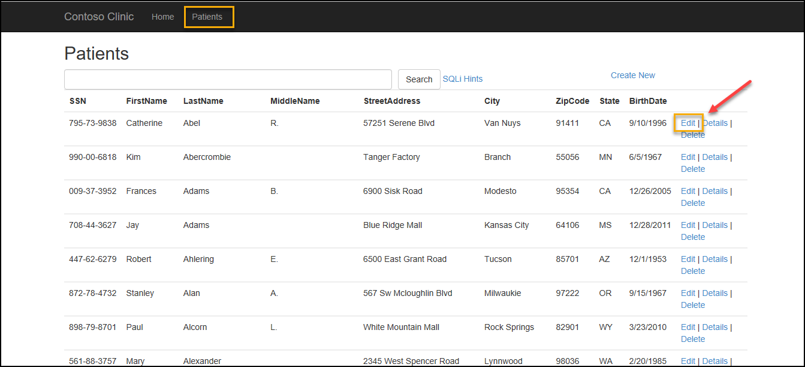

# Objective of the POC
Showcase a Cross Site Scripting (XSS) attack and mitigation on a Web Application 

# Prerequisites
Access to Azure subscription to deploy following resources 
1. Application gateway (WAF enabled)
2. App Service (Web App)
3. SQL Database 
4. OMS (Monitoring)

# Deploy

1. Go to Edge Browser and Open [Azure Cloud Shell](https://shell.azure.com/)
1. Change directory to CloudDrive directory 

    `cd $Home\CloudDrive `

1. Clone Azure-Security-Scenarios repos to CloudDrive.

    `git clone https://github.com/AvyanConsultingCorp/azure-security-scenarios.git`

1. Change directory to azure-security-scenarios
 
    `cd .\azure-security-scenarios\`

1. Run below to get list of supported scenarios

    `.\deploy-azuresecurityscenarios.ps1 -Help`

1. If you are using Cloud Shell you can simply pass 2 parameters to run the deployment.

    `.\deploy-azuresecurityscenarios.ps1 -Scenario "xss-attack-on-webapp" -Command Deploy  -Verbose`

1. However, if you are running on a local machine pass additional parameters to connect to subscription and run the deployment.

    `.\deploy-azuresecurityscenarios.ps1 -SubscriptionId <subscriptionId> -UserName <username> -Password <securePassword> -Scenario "xss-attack-on-webapp" -Command Deploy   -Verbose`

# Attack
Attack on web app with
* Application gateway - WAF - Detection mode 
 

1. Go to Azure Portal --> Select Resource Groups services --> Select Resource Group - <prefix> "-xss-attack-on-webapp"

2. Select Application Gateway with name 'appgw-detection-' as prefix.

 


3. Application Gateway WAF enabled and Firewall in Detection mode as shown below.

    

4. On Overview Page --> Copy Frontend public IP address as
    

5. Open Internet Explorer with above details as shown below  
    

4. Click on Patient link and select Edit option 

    

4. Perform XSS attack by copying javascript code " **<script>alert('test script')</script>** " in MiddleName text box and click on "Save". 
  


5. Application will save data in database and dispaly it on dashboard
.

        
    
    
# Detect
To detect the attack execute following query in Azure Log Analytics

AzureDiagnostics | where Message  contains "xss" and action_s contains "detected"
         
    
# Prevention

  * Update Web application firewall mode to Prevention for application gateway. This will take 5-10 mins. Hence we will connect the application using Application Gateway (WAF- Prevention mode) 

        
    
  

## Detection after Prevention

* Execute the step 6 and 7 to perform XSS attack, Application Gateway will prevent access

      

 
* To detect the prevention of attack execute following query in Azure Log Analytics


    AzureDiagnostics | where Message  contains "xss" and action_s contains "blocked"
    
      


You will notice events related to detection and prevention items. It might take few hours for OMS to pull logs, so if you don't get any search results, please try again after sometime.


## Clear Deployment 

Run following command to clear all the resources deployed during the demo.

```
.\deploy-azuresecurityscenarios.ps1 -Scenario xss-attack-on-webapp -Cleanup 
```

Verification steps -
1. Login to Azure Portal / Subscription
2. Check if all the ResourceGroup with deploymentSuffix is cleared.


**References** 

https://docs.microsoft.com/en-us/azure/application-gateway/application-gateway-introduction
 
https://docs.microsoft.com/en-us/azure/application-gateway/application-gateway-web-application-firewall-overview

